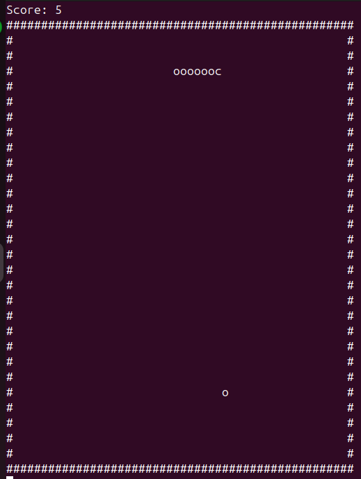

# [Snake Game](https://github.com/rahulrajdahal/snake-game-c-sharp). Play the awesome snake game you love

Eat and grow your snake to the highest level.

- Score board
- Eat rewards and grow your snake

## Preview

[](https://github.com/rahulrajdahal/snake-game-c-sharp)

## 🏗 Development Guide

### 1. clone the repository

```sh
git clone https://github.com/rahulrajdahal/snake-game-c-sharp.git
```

### 2. Navigate to the directory

#### npm

```sh
cd snake-game-c-sharp
```

### 3. Build the game

```sh
dotnet build
```

### 4. Run the game

```sh
dotnet run
```

## 🚀 Project Structure

Inside of project [Snake Game](https://github.com/rahulrajdahal/snake-game-c-sharp), you'll see the following folders and files:

```text
/
├── screenshots/
│   └── screenshot.png
├── Coord.cs
├── Direction.cs
├── Program.cs
└── README.md
```

## 🧞 Commands

All commands are run from the root of the project, from a terminal:

| Command        | Action          |
| :------------- | :-------------- |
| `dotnet build` | Build the game. |
| `dotnet run`   | Run the game.   |
